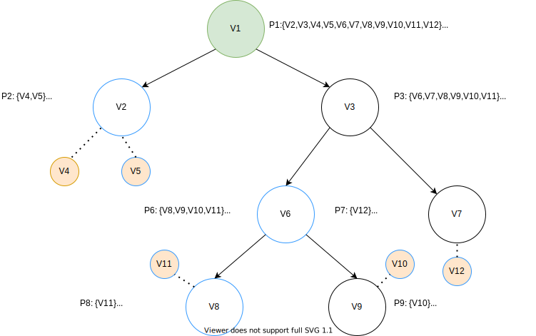
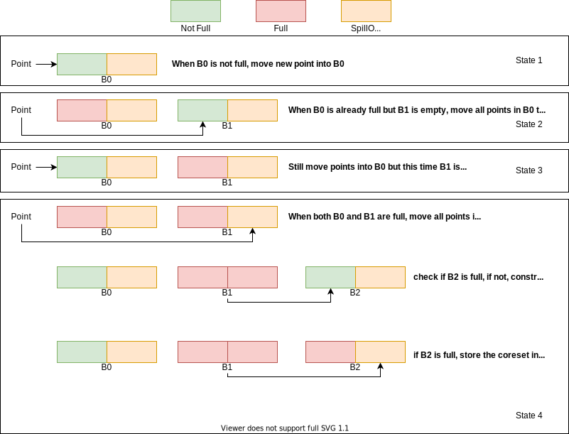

# StreamKM++

## Noted  
please install the following plugin in order top read the math formula
https://chrome.google.com/webstore/detail/mathjax-plugin-for-github/ioemnmodlmafdkllaclgeombjnmnbima/related

## Input:

**./stream    filename    n     k    d     c     outputfile     seed**

```
n is the number of points in the data set.
k is the number of clusters to compute.
d is the dimensionality of the points;  
c specifies the size of the coreset.
outputfile contains the calculated centroids of the k clusters in format: w x1 x2 ... xd
where w is the weight if the centroid.
seed must be an integer and it will be used to seed the random number generator.
```

**Data format:**  using space to separate different features of one point,  wrapping if different data point.

## Output:

**Data format:**  output the clustering centers with the number of $k$，$w, x_{1}, x_{2}, x_{3}, ... ,x_{n}$，$w$ is the weight(clustering point number) of the clustering center

## Algorithms：

#### **Overview:**

Using merge and reduce to collect the data block from the streaming data. Constructing coreset tree via merging the full block.【**landmark window**】 While the streaming data end coming and all the full blocks have been merged, we then collect the nodes of the coreset tree with size $m(m>k)$**【online procedure】**,  finally we use these tree nodes to conduct kmeans to get the $k$ clustering centers.**【offline procedure】**

#### Offline KMeans

https://www.cnblogs.com/yixuan-xu/p/6272208.html

（1）首先随机在输入点集中随机筛选一个初始聚类中心，并将它纳入空点集S中

（2）计算每一个点被纳入空点集s中的概率，依据概率使用轮盘法选出第二个聚类中心加入s

（3）循环执行第二步直到s中元素到达k个

#### **Coreset Construction:**

依据$\mathrm{d}(x, C)=\min _{c \in C} \mathrm{~d}(x, c)$, $\operatorname{cost}(P, C)=\sum_{x \in P} \mathrm{~d}^{2}(x, C)$以及$P=\frac{\mathrm{d}^{2}(p, S)}{\operatorname{cost}(P, S)}$ 按照上面的seeding步骤随机筛选出聚类中心$S=\left\{q_{1}, q_{2}, \ldots, q_{m}\right\}$, 设置距离阈值r，从输入点集中找到针对每一个$P_{i}$对应的邻居点集$Q_{i}$，将$S$中每个点对应的权重函数$w_{i}$设置$|Q_{i}|$, 从而构建coreset结构 $C_{i}=w_{i}\times q_{i}$

#### **Coreset Tree:**

Coreset tree aims at solving the problem that kmeans runs too slow ( for the next cluster center $p_{i+1}$, we need to recompute the distance from each point in $P$ to its nearest neighbor in currnet cluster center set $S$ ). However, coreset tree only needs to recompute the distance of every data point in the sub cluster $P_{v}$ with node $v$.**【Containg Problem: when a new data point comes, the two clusters may need to get merged into the bigger one!】**

**(1) Node Structure**

<u>Given the input data $S$, the structure of  the constructed tree node $v$ is $[P_{v}, q_{v}, L_{v}, cost_{v}]$</u>

$P_{v}$: The subset of $s$ containing points relevant to node $v$, in other words, the whole cluster points in which $v$ is the clustering center.

$q_{v}$:  Randomly choose from $P_{v}$, to be the child node of $v$, one of the points with very high $d^{2}$ in $P_{v}$ cluster

$L_{v}$ : The number of points in $P_{v}$

$cost_{v}$: Equals to $cost(P_{v}, q_{v})$

**(2) Tree Building Procedure**

- To begin with, we find the cluster center $T$ of the whole input data $P$ and we choose $T$ as the root of the coreset tree. We set attribute $P_{v}$ as the whole input data. The attribute $q_{1}$ of the root is our first point in $S$ and computed by choosing uniformly at random one point from $P$.
- So how to select the new clustering center $q_{i+1}$ from $P_{v}$ ? we use the $P=\frac{\mathrm{d}^{2}(p, S)}{\operatorname{cost}(P, S)}$ as probability to sample it from $P_{v}$.
- When the current leaf nodes are $\{v_{1}, v_{2}, v_{3}, v_{4},..\}$, and the corresponding representative points are $\{q_{1}, q_{2}, q_{3}, q_{4},...\}$. Currently we randomly selected clustering center $q_{i+1}$ with very high distance value, how to choose its parent nodes to add in the tree?  Let $v$ be the parent nodes starting from the root $T$, we randomly choose $v$'s child node $u$ according to the probability  $\frac{cost(v)}{cost(u)}$, and then we replace $v$ as $u$ and continue searching deeply until we find the leaf node to place $q_{i+1}$.
- Consequently, how to split the parent nodes, here we choose the selected $q_{i+1}$ and the original $q_{i}$ stored in the parent node as the two child nodes and split the whole $P_{v}$ according to the distance from the two child nodes.

**(3) Example**



**(4) Streaming Method**

So here is the flowchart of the streaming method used in StreamKM++**(merge and reduce)**, the coreset construction process doesn't start until both of the buckets $B_{0}$ and $ B_{i}$ are full. Thus actually this algorithm will construct coreset tree of size $m$  with total $\left\lceil\log _{2}\left(\frac{n}{m}\right)+1\right\rceil$ times. **【Meaning that StreamKM++ cannot handle concept drift in real time】**After constructing the final coreset tree, all of the nodes in the final tree will be the clustering center. Finally we conduct Kmeans++ on those $m$ point data and extract $k$ clustering center.

```flow
graph TD

st=>start: start constructing coreset
e=>end: output the final coreset
op1=>operation: i=1
op2=>inputoutput: fill the points into B0 bucket
op3=>operation: move the points into Bi bucket
op4=>operation: empty B0
op5=>operation: compute the coreset Q according to B0 and Bi|current
op6=>operation: empty B0 and Bi
op7=>operation: i=i+1
op8=>operation: move Q of size m to Bi 
 
 
 
cond1=>condition: if B0 is full
cond2=>condition: if Bi is full
 
st->op1(right)->op1(right)->op2->cond1
cond1(yes)->cond2
cond1(no)->op2
cond2(no)->op3(right)->op4(right)->op2
cond2(yes)->op5->op6->op7(right)->op8->op2
```

#### Coding:

**<u>(1) Initialization</u>**:

init_genrand

initManager/ initBucket/ initPoint

<u>**(2) Inserting Block:**</u>

While(i<length){

​	getNextPointLiadan

​	insertPoint...

}

The concrete process is shown as follows:



<u>**(3) Get final coreset from the buckets after the streaming process:**</u>

getCoresetFromManager(needs to consider whether the final block is full)

<u>**(4) Offline Kmeans 5 times**:</u>


 